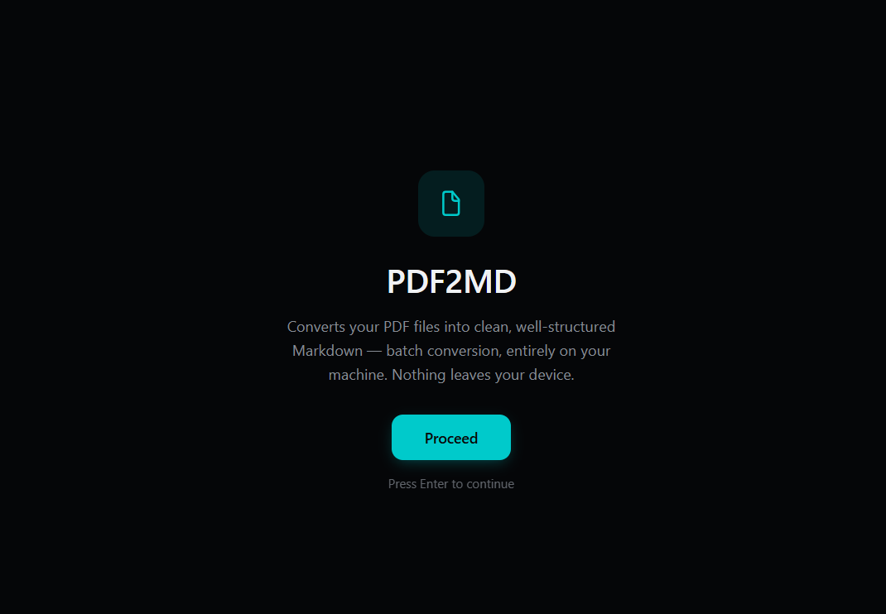
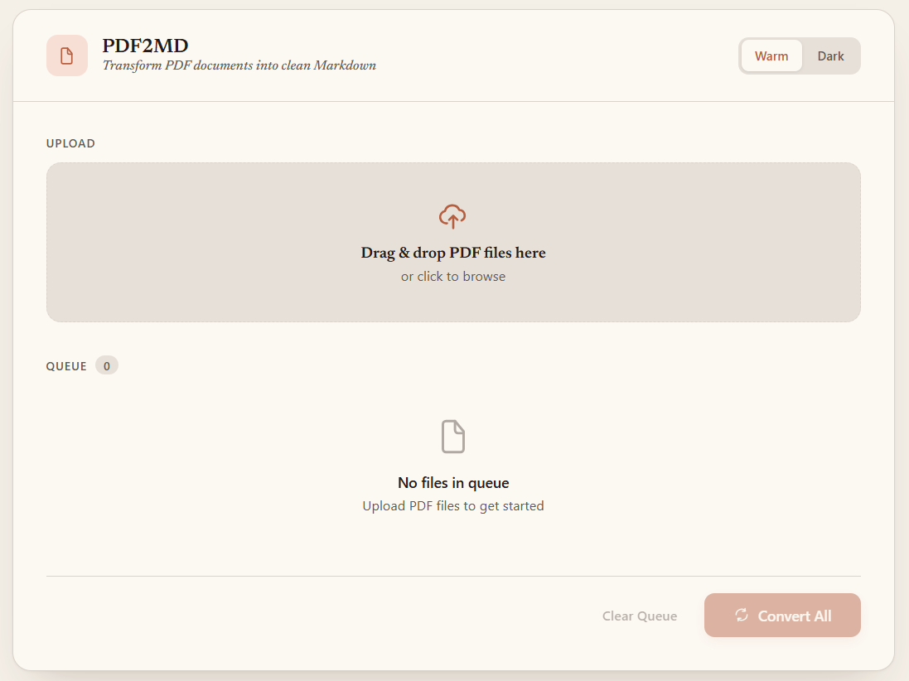
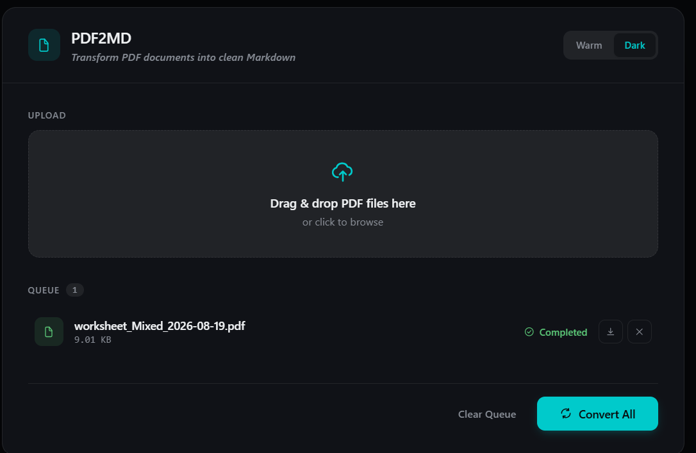
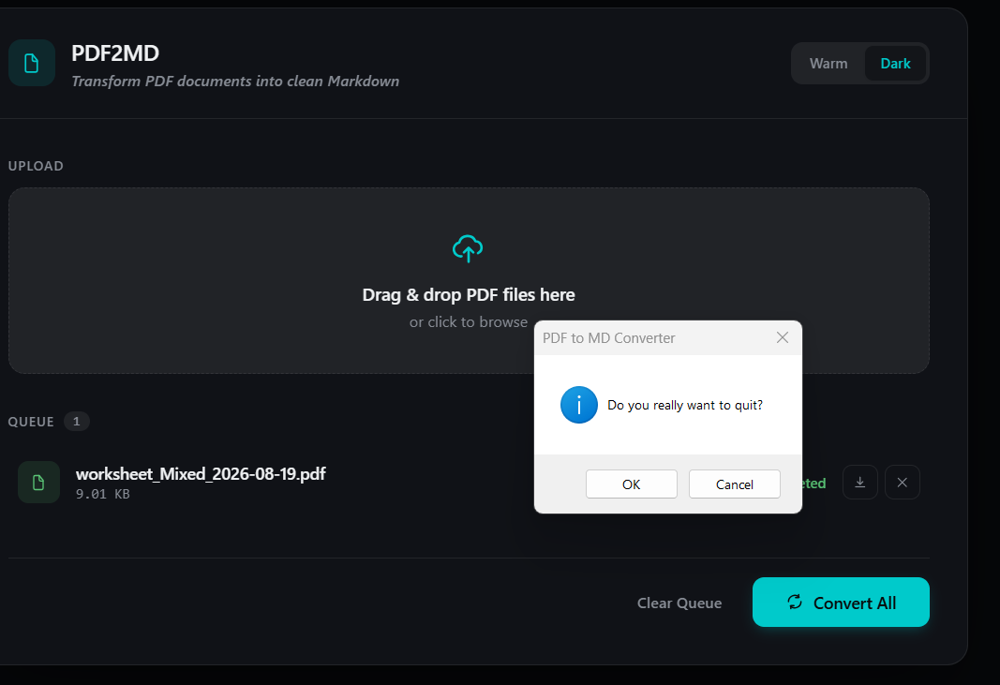

# PDF to MD Converter

<p align="center">
  
  
  
</p>

A cross-platform desktop application that converts PDF files to clean Markdown. Built with a restrained, two-theme UI, drag-and-drop support, and native OS file dialogs for a seamless user experience.

> **Before you convert anything important, read [What PDF2MD Preserves](LIMITATIONS.md).**
> It sets out what survives a conversion intact, what comes out approximate, and what is
> dropped without warning — diagrams above all — along with the measurements behind each
> claim and a five-minute checklist for auditing your own output.


## Screenshots

<table>
<tr>
<td width="50%"><br><sub>Startup splash</sub></td>
<td width="50%"><br><sub>Warm Editorial theme</sub></td>
</tr>
<tr>
<td width="50%"><br><sub>Pro Dark theme</sub></td>
<td width="50%"><br><sub>Exit confirmation</sub></td>
</tr>
</table>

## Features

- 📄 **Drag & Drop Upload** — Intuitive file upload with visual feedback
- ⚡ **Batch Conversion** — Convert multiple PDFs simultaneously with real-time progress tracking
- 🌗 **Warm / Dark Themes** — Two considered themes, switchable in-app and remembered across launches
- 💻 **Code Blocks Preserved** — Monospaced listings become fenced code with their line breaks and indentation intact, instead of being reflowed into a paragraph
- 📊 **Tables Rebuilt** — Columns are recovered from page geometry, so whitespace-aligned tables become real Markdown tables, not a run of words
- 🔍 **Optional OCR** — On-device text recognition for scanned pages with no text layer, so they don't convert to nothing (see [OCR Support](#ocr-support))
- 🖼️ **Visible Image Markers** — Images that can't be represented in Markdown are marked in the output instead of silently disappearing
- 🔁 **Smart Deduplication** — Prevents duplicate file uploads in the queue
- 💾 **Native Save Dialog** — Choose any folder to save your Markdown files (falls back to a normal browser download outside the desktop shell)
- 🚪 **Exit Confirmation** — Confirms before closing so you don't lose an in-progress queue
- 🖥️ **Cross-Platform** — Windows and Linux are built and tested; macOS is expected to work via the same pywebview/PyInstaller path but is untested (see [Platform Support](#platform-specific-notes))
- 📦 **Standalone Executable** — Package as a single distributable binary

## Quick Start

### Prerequisites

- Python 3.9 or higher
- pip

### Installation

```bash
# Clone the repository
git clone https://github.com/<your-username>/pdf2md.git
cd pdf2md

# Create virtual environment
python -m venv .venv

# Activate virtual environment
# Windows:
.venv\Scripts\activate
# macOS/Linux:
source .venv/bin/activate

# Install dependencies
pip install -r requirements.txt
```

### Run the App

```bash
python desktop.py
```

## Building Standalone Executables

Package the app for your current platform:

```bash
pyinstaller pdf2md.spec
```

The executable will be generated in the `dist/` folder:
- **Windows:** `dist/PDF2MD.exe`
- **macOS:** `dist/PDF2MD`
- **Linux:** `dist/PDF2MD`

### Platform-Specific Notes

#### Windows — built & tested
```bash
pyinstaller pdf2md.spec
```
Distribute `dist/PDF2MD.exe`. No additional dependencies needed. This is the platform this app is actually developed and tested against.

#### Linux — built via the same spec, testing welcome
```bash
pyinstaller pdf2md.spec
```
The binary should work on most modern Linux distributions. For broader compatibility, consider building on an older distro (e.g., Ubuntu 20.04) using Docker or a VM. The OCR path in particular (RapidOCR/onnxruntime/opencv) hasn't been verified on Linux yet — if you build it there, an issue report either way (works / doesn't) is welcome.

#### macOS — pending, untested
```bash
pyinstaller pdf2md.spec
```
Nothing in the code is Windows-specific, and pywebview/PyInstaller both support macOS, but this hasn't been built or run on macOS at all. Treat it as unverified until someone does. For distribution outside your own machine, you'll likely also need to code-sign, notarize with Apple, and produce a proper `.app` bundle — none of which this repo currently automates.

## Usage

1. **Launch** the app with `python desktop.py`
2. **Upload** PDF files by dragging them into the drop zone or clicking "Browse Files"
3. **Convert** — Click "Convert All" to start batch conversion
4. **Download** — After conversion completes, click the download icon to save each `.md` file to your preferred location
5. **Clear** — Remove all files from the queue with "Clear Queue"

## Project Structure

```
pdf2md/
├── app.py                 # Flask backend (upload, conversion, download API)
├── converter.py           # PDF to Markdown conversion logic (PyMuPDF + optional RapidOCR)
├── desktop.py             # Desktop app entry point (PyWebView wrapper)
├── pdf2md.spec            # PyInstaller build configuration
├── requirements.txt       # Python dependencies
├── LIMITATIONS.md         # What the tool preserves, approximates and drops
├── CHANGELOG.md           # Release history
├── docs/
│   └── fidelity.html      # Styled version of LIMITATIONS.md
├── templates/
│   └── index.html         # Warm / Dark themed UI
├── assets/                # App icon (.ico / .png)
├── screenshots/           # README screenshots
├── uploads/               # Temporary PDF uploads (auto-created)
├── outputs/               # Converted Markdown files (auto-created)
└── dist/                  # Built executables (generated)
```

## Tech Stack

| Component | Technology |
|-----------|-----------|
| **Backend** | Flask 3.0+ |
| **PDF Processing** | PyMuPDF 1.28+ |
| **OCR (optional)** | RapidOCR (ONNX Runtime) + OpenCV |
| **Desktop Wrapper** | PyWebView 5.0+ |
| **Packaging** | PyInstaller 6.0+ |
| **Frontend** | HTML5, CSS3 (custom properties, animations), vanilla JavaScript |

## Configuration

### Output Location

By default, converted `.md` files are saved to:
```
<project-root>/outputs/<filename>.md
```

The actual conversion happens in the `outputs/` folder, but when you click **Download**, you can choose any destination folder via the native OS save dialog.

### Duplicate Handling

- **Client-side:** Duplicate filenames in the queue are blocked with an error toast
- **Server-side:** If multiple files share the same name, outputs are auto-incremented: `file.md`, `file_1.md`, `file_2.md`

## OCR Support

PyMuPDF only extracts text that already exists in the PDF's text layer. A scanned document — a page that's really just a photo of text, with no underlying text layer — has none, so by default it converts to nothing.

Check **"OCR scanned pages"** before converting to fix that. When enabled, any page with images but *no* extractable text is rendered to an image and run through [RapidOCR](https://github.com/RapidAI/RapidOCR) (ONNX Runtime, on-device — no cloud, no API key, nothing leaves your machine). Pages that already have real text are left alone; embedded images that appear alongside real text are marked as `*[image]*` in the output rather than silently dropped, whether or not OCR is on.

Trade-offs worth knowing before you flip it on:

- **Slower.** OCR runs a few seconds per page, versus near-instant for normal text extraction. A large scanned PDF will take noticeably longer to convert.
- **Lower fidelity than real text.** OCR output is a best-effort transcription — expect occasional misreads, and no attempt to preserve tables, multi-column layout, or headings from a scanned page.
- **Bigger install / build.** `rapidocr-onnxruntime` pulls in `onnxruntime` and `opencv-python`. This grows `pip install -r requirements.txt` noticeably and takes the built executable from ~30MB to **~125MB** (measured on Windows). If you don't need OCR, you could remove `rapidocr-onnxruntime` from `requirements.txt` and drop it from the `collect_all(...)` loop in `pdf2md.spec` to keep the smaller build — the app runs fine without it; the checkbox just won't do anything useful.
- **Windows/Linux only, for now.** Same caveat as the rest of the app — verified on Windows, expected but unverified on Linux, untested on macOS.

## Troubleshooting

### `ModuleNotFoundError: No module named 'flask'` (or `pymupdf`, `webview`)
Make sure you activated the virtual environment:
```bash
.venv\Scripts\activate  # Windows
source .venv/bin/activate  # macOS/Linux
```

### `ImportError: DLL load failed while importing _extra`
This is a PyMuPDF dependency issue on Windows. Fix it by upgrading PyMuPDF:
```bash
pip install --upgrade PyMuPDF
```

### PyInstaller build fails
Make sure you're using Python 3.9+. Some packages may require additional hooks. Check the PyInstaller logs for missing modules.

## Contributing

Contributions are welcome! Please follow these steps:

1. Fork the repository
2. Create a feature branch (`git checkout -b feature/amazing-feature`)
3. Commit your changes (`git commit -m 'Add amazing feature'`)
4. Push to the branch (`git push origin feature/amazing-feature`)
5. Open a Pull Request

## Roadmap

- [x] Dark/light theme toggle
- [x] OCR support for scanned PDFs (on-device, opt-in — Windows/Linux; macOS untested)
- [x] Preserve code listings as fenced blocks
- [x] Rebuild tables as Markdown tables
- [ ] Per-conversion quality report (what was preserved, what was lost)
- [ ] Rejoin tables split across a page break
- [ ] Extract embedded images alongside the Markdown
- [ ] Batch export to ZIP
- [ ] Markdown preview with syntax highlighting
- [ ] Custom CSS styles for PDF-to-MD conversion
- [ ] Progress persistence across app restarts
- [ ] Plugin system for custom converters

## Changelog

Release history is in [CHANGELOG.md](CHANGELOG.md). The current release is **v1.1.0**, which
adds fenced code blocks and Markdown table reconstruction.

## License

This project is licensed under the MIT License — see the [LICENSE](LICENSE) file for details.

## Acknowledgments

- [PyMuPDF](https://github.com/pymupdf/PyMuPDF) — PDF text extraction
- [RapidOCR](https://github.com/RapidAI/RapidOCR) — On-device OCR for scanned pages
- [Flask](https://flask.palletsprojects.com/) — Backend web framework
- [PyWebView](https://pywebview.flowrl.com/) — Native desktop window wrapper
- [PyInstaller](https://pyinstaller.org/) — Executable packaging

---

<p align="center">Built with ❤️ for the open-source community</p>
